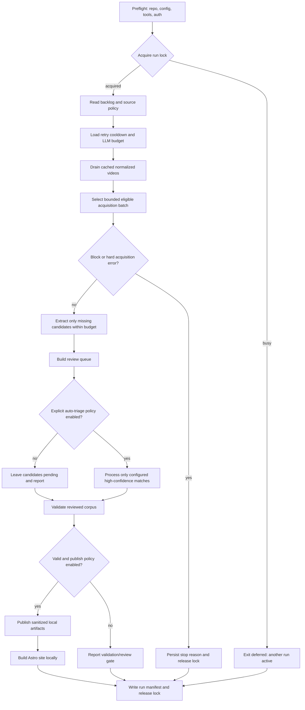

# Daily timer automation review — 2026-07-16

## Executive summary

The repository can already perform most data work from a terminal, but it does not yet have a safe daily-run entry point. A Windows Task Scheduler job could invoke the Python CLI and, where configured, the Codex CLI without any ChatGPT app session. The ChatGPT app is currently the operator interface for shortcuts such as `cp`, review decisions, visual inspection, and release judgment; it is not a runtime dependency of the processors.

The recommended design is a small, single-run orchestrator with a lock, a private run manifest, explicit workset selection, daily LLM-budget enforcement, block cooldown handling, and a stop-before-risk policy. It should drain cached work first, process only a small configured acquisition batch, and leave new or ambiguous knowledge in the review queue. It should never commit, push, deploy, auto-verify visual evidence, or publish unreviewed concepts.

This document is a review and design proposal. It does not register a Windows timer or change production behavior.

## ChatGPT app versus Codex CLI

| Capability | ChatGPT app | Codex CLI | Suitable for a timer? |
|---|---|---|---|
| `cp`, `u`, `cm`, review conversations | Human-facing shortcuts and judgment | Not involved | No; replace with a deterministic command and a report |
| Python ingestion, queue building, validation, publishing | The app currently starts commands for the operator | Not required | Yes, subject to locks and failure handling |
| Candidate extraction and excerpt rephrasing | The app may ask for or review the result | `codex exec` is invoked by Python with the configured low-cost model | Yes, if the timer account has Codex CLI authentication and the daily budget allows it |
| Visual demonstration selection | Human watches nearby footage and approves windows | Not a substitute for watching the complete clip | No; remain a review gate |
| Concept approval, merge, rejection, and public release | Human editorial decision | Can propose only | No; keep explicit review state |

The Codex CLI is therefore an optional subprocess dependency for an unattended local run. No ChatGPT browser tab, app window, or conversation state is needed. The timer must run under the same Windows account (or a deliberately configured service account) that has the repository, Python environment, and `codex login` state.

## Current pipeline inventory

| Stage | Current command or implementation | Current unattended risk | Timer disposition |
|---|---|---|---|
| Discovery | `processors.cli discover URL --kb ID` | Writes one discovery manifest and does not choose a daily workset. Network access can be blocked. | Optional, small and paced; do not make discovery itself publishable. |
| Ingestion | `processors.cli ingest URL... --kb ID` | Requires explicit URLs; retries are recorded, but repeated invocations can overlap unless externally locked. | Use a bounded selected batch, cache first, honor cooldown and stop on a block. |
| Cached transcript drain | `ingest` reuses normalized files | Safe and deterministic, but there is no command that enumerates “missing downstream artifacts.” | First phase of every run. |
| Codex extraction | `extract-concepts --engine codex` | Without `--video-id`, it loads every normalized video and invokes Codex again even when a candidate file already exists. This can waste the daily budget. | Add an idempotent missing-candidate workset before unattended use. |
| LLM budget | Private per-KB ledger and `llm-deferred.json` | The guard works, but a timer needs a clear deferred exit status and run summary. | Keep enabled; stop/defer rather than bypass. |
| Review queue | `build-review-queue` | Deterministic and preserves decisions, but queue growth still needs reporting. | Safe to run every day. |
| Candidate triage | `process-pending` | Can mutate canonical concepts for high-confidence matches. This is an editorial policy decision, not merely a build step. | Default off in timer mode, or require an explicit automation policy and threshold. |
| Visual review | YAML `visual_source` and `visual_status` | Cannot be safely approved from transcript text alone. | Never auto-verify; report pending visual work. |
| Validation | `validate` / `validate-published` | Deterministic, but must fail the run before publication if errors occur. | Required gate. |
| Publishing | `publish` | Plain publish is deterministic; optional auto-rephrase invokes Codex and can defer. Publishing changes local artifacts but not GitHub by itself. | Allow only reviewed content; auto-rephrase opt-in and budget-gated. |
| Site build | `npm run build` | Needs Node/npm and is independent of ChatGPT. | Run after a successful local publish; do not deploy from the timer. |
| Commit/deploy | Git and GitHub Actions | Would create external state and could expose unreviewed changes. | Never part of the daily timer. |

## Findings and priority

### P0 — No single daily-run contract

There is no `daily-run` CLI command or wrapper that defines ordering, exit codes, locking, run IDs, and what “success” means. The `cp` shortcut is an instruction to an assistant, not an executable interface. A timer would otherwise need to reproduce policy in a fragile batch file.

### P0 — Extraction is not idempotent by default

`extract-concepts` processes every normalized video when no video ID is supplied, and `extract_video()` writes a candidate file after invoking Codex without first checking whether the same input/prompt hash already has a current candidate. A daily job must select only normalized videos that lack a current candidate, or explicitly request a refresh. This is the most important cost-control gap.

### P1 — No machine-readable daily workset

The source catalog records selected videos, but `ingest` still needs explicit URLs. There is no deterministic command that selects the next eligible `selected: true` videos while excluding members-only/inaccessible entries, already normalized videos, active retry cooldowns, and videos already present in the derived corpus. The workset should be recorded in the run manifest before network access.

### P1 — Human gates are not explicit timer policy

`process-pending` can accept high-confidence matches and edit canonical YAML. Visual verification, concept merges, new taxonomy, and public release remain human responsibilities. The timer needs a policy file or flags that default to “queue only” and make any automatic acceptance opt-in and auditable.

### P1 — Failure and partial-run state is scattered

Ingest retry state and the LLM ledger are persisted, but there is no single per-run record containing phase status, selected IDs, commands, exit codes, counts, budget status, and the reason for deferral or stop. Without this, a scheduled run can be technically successful while silently doing no work or leaving an ambiguous partial state.

### P1 — Scheduler environment must be designed, not assumed

The timer account needs a stable working directory, the checked Python interpreter, Node for the site build, `codex` on `PATH`, Codex authentication, optional proxy/cookie environment variables, and write access to private `data/`. A scheduled process must not depend on an interactive PowerShell profile, a mounted drive, a VPN window, or a ChatGPT app session.

### P2 — No notification or retention policy

There is no email/desktop/webhook notification for a block, budget deferral, validation failure, or repeated no-work run, nor a documented retention limit for run manifests. Add notifications only after the core runner is reliable and keep all reports private by default.

## Proposed daily state machine



### Recommended safe defaults

- Run one knowledge base per invocation, starting with `--kb table-tennis`.
- Acquire a lock before reading or writing pipeline state; stale locks need an age check and a safe operator override.
- Drain cached normalized transcripts and candidates before making any network request.
- Ingest only `selected: true`, public, not-yet-normalized URLs from the configured catalog; cap uncached requests at the existing conservative limit (8) and normally use a smaller daily batch.
- Respect `ingest-retries.json`, the block circuit breaker, request delay, jitter, and the “no large scrape” backlog gate. A block ends the acquisition phase immediately.
- Extract only missing or explicitly stale candidates. Reserve the configured LLM budget before each Codex CLI call; defer the remainder when the budget is exhausted.
- Keep the configured `gpt-5.4-mini` profile and automatic escalation disabled. The timer must not silently select `fast` or a stronger model.
- Build the review queue every run. Keep new concepts pending and do not auto-verify visual windows.
- Keep `process-pending` disabled by default. If enabled later, require a checked-in policy setting, a confidence threshold, and a manifest entry listing every canonical YAML mutation.
- Run validation before local publish. Do not enable `--auto-rephrase-high-overlap` unless the operator explicitly opts in for that run and the budget status is sufficient.
- Build the Astro site locally for verification, but never commit, push, or deploy from the timer.
- Keep all run manifests, Codex audit data, transcripts, cookies, proxy credentials, and media under private/gitignored paths.

## Proposed timer contract

The eventual executable should be a deterministic command such as:

```powershell
.\.venv\Scripts\python.exe -m processors.cli daily-run `
  --kb table-tennis `
  --max-new-videos 2 `
  --auto-triage false `
  --publish-local true
```

The exact flags can be simplified by a checked-in automation policy, but the command must be explicit about the KB and must not depend on ChatGPT shortcuts. A PowerShell wrapper should set the repository root, `PYTHONUTF8=1`, log paths, and environment variables, then invoke the Python command using an absolute interpreter path.

Suggested exit classes:

| Exit class | Meaning | Timer action |
|---|---|---|
| 0 | Completed safely; work may or may not have been available | Record success and counts |
| 10 | Deferred by lock, budget, retry cooldown, or backlog gate | Keep state; notify only after repeated occurrences |
| 20 | Partial safe failure, such as one acquisition failure after retained successes | Keep successful artifacts; review the manifest |
| 30 | Configuration, tool, or Codex authentication failure | Alert the operator; do not retry rapidly |
| 40 | Validation or publish safety failure | Alert and require review before another publish |

These classes are more useful to Task Scheduler than parsing console text. The run manifest should include the actual command version, start/end timestamps, local timezone, git commit (read-only), selected URLs/video IDs, phase results, exit class, budget status, retry state, and paths to private logs.

## Windows Task Scheduler boundary

After the runner exists and passes local tests, the operator can register it in Task Scheduler with a daily trigger. Registration should be manual because it creates an OS-level recurring job and depends on the chosen account, network route, and privacy policy. The action should call a repository-owned wrapper with “Start in” set to the repository root, run only when the intended user account is available, and prevent overlapping instances.

Do not use GitHub Actions for daily YouTube acquisition or Codex extraction. Public CI is appropriate for deterministic validation and building reviewed public artifacts, but it is a poor place for private transcripts, credentials, VPN/proxy state, YouTube requests, or account-billed LLM work.

## Implementation sequence

1. Add `daily-run` as a dry-run/report-only command that computes the workset and writes a run manifest without network or Codex calls.
2. Add a cross-platform lock, phase results, exit classes, and stale-lock recovery requiring an explicit override.
3. Add idempotent missing-candidate selection keyed by normalized input hash and candidate provenance; keep explicit `--force` for refreshes.
4. Add a checked-in per-KB automation policy for batch size, auto-triage, local publish, auto-rephrase, and build behavior.
5. Add a `scripts/run-daily.ps1` wrapper and tests that run from a non-interactive working directory with a minimal environment.
6. Add private run-summary output and optional notifications after repeated failures/deferrals.
7. Only then register a Windows timer and observe it in dry-run mode before enabling network acquisition.

## Acceptance criteria

- A daily timer can run without the ChatGPT app, browser tabs, or shortcut prompts.
- The timer never starts two runs concurrently and leaves a recoverable manifest after interruption.
- A rerun after success does not invoke Codex or refetch already complete videos unless explicitly forced.
- A YouTube block, missing transcript, missing Codex authentication, or exhausted budget stops/defer safely and is visible in the manifest.
- No new concept, visual demonstration, excerpt rewrite, commit, push, or public deployment is silently approved by the timer.
- Private transcripts, audit output, media, cookies, and credentials never enter `data/publish/`, `app/public/`, Git, or GitHub Pages.
- The local run can be reviewed through a concise report before any human chooses to accept, publish, or deploy changes.

## Review conclusion

The project is close to timer-capable at the individual-command level, but not at the orchestration level. The next implementation should focus on a small, auditable `daily-run` command and idempotent workset selection rather than adding more scraping capacity. Until those controls exist, continue using the documented manual/assistant-led sequence for acquisition and editorial review.
